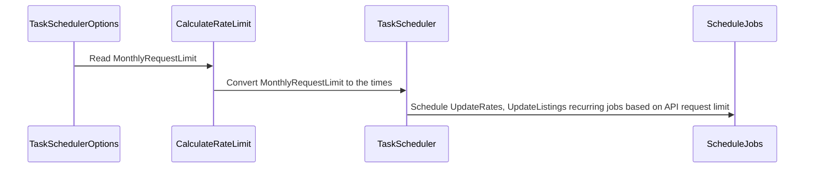
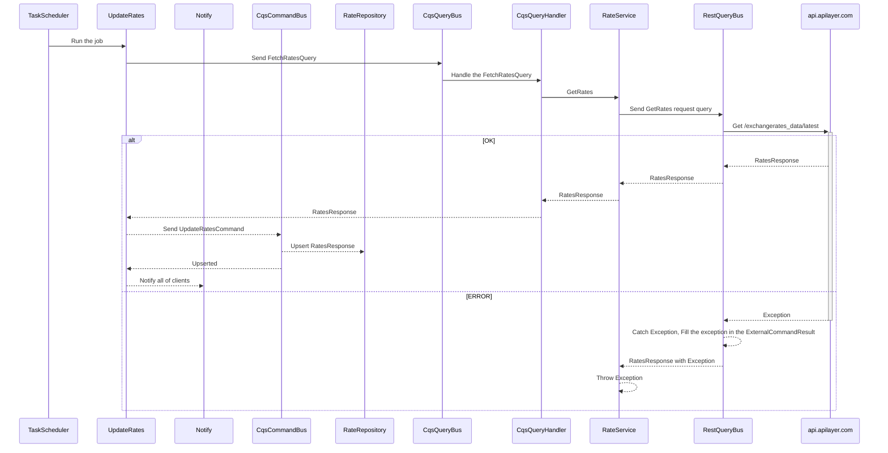
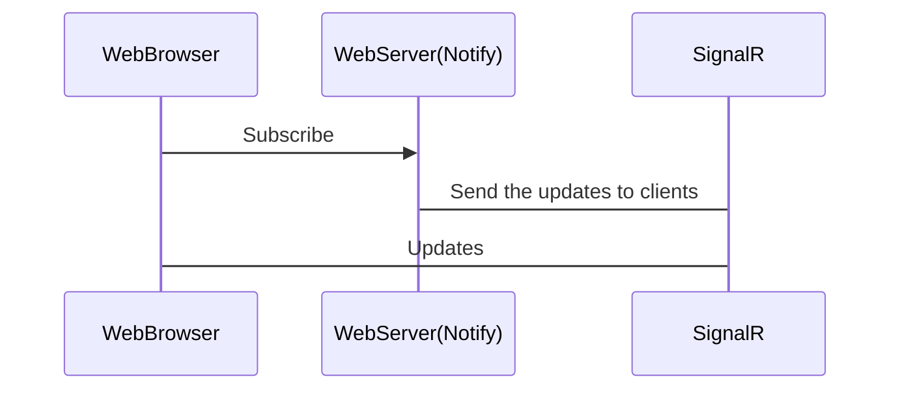

# Crypto-Exchange
The Crypto-Exchange web application sample obtains the top 100 crypto currencies from https://coinmarketcap.com/api and converts their values to USD, EUR, BRL, GBP, and AUD (rates obtained from https://exchangeratesapi.io/).

## Task Scheduler
TaskScheduler is in charge of scheduling two tasks:
- UpdateRates: Get rates from https://exchangeratesapi.io/
- UpdateListings: Get listing from https://coinmarketcap.com/api

Because these free APIs have a monthly request limit, we must compute the number of times we can fetch the data (in days, hours, and minutes).
The app schedules tasks based on the times.

### UpdateRates task

### UpdateListings task

The sequence is same as UpdateRates

## Streaming price changes
App uses SignalR to send the updates to the clients. SignalR first attempts to establish a WebSocket connection if possible.

## Architcture

The app adheres to Clean Architecture.

Explanation:

- **Core.Abstraction**: The innermost layer is free of dependencies.

- **Domain**: Implements the entity interface using `Core.Abstraction`.

- **Application**: `Domain` is used for entities (input) and `Integration` is used for DTOs (output).

- **Integration**: Makes use of `Core` to implement IMediatR commands and queries, as well as DTOs.

- **Core**: Implements technologies using `Core.Abstraction` and registers IMediatR commands and queries using `Core.Infrastructure`:

  - *IMediatR*: For the `CQS` pattern (at the class or component level).

  - *Newtonsoft*: To serialize

  - *RestSharp*: For rest requests

  - *FluentValidation*: This is used for DTO validations.

- **Core.Infrastructure**: Contains an assembly helper that allows us to register all classes using a single interface to IoC.

- **Application.TaskScheduler**: This layer uses `Core.Abstraction` and `Integration` to schedule a task. It also uses 'HangFire' as the technology.

- **Data.InMemory**: For entity access, uses `Core.Abstraction` and `Domain`.

- **Application.ExchangeRatesApi**: `Application` and `Integration` are used. It contains the `ExchangeRatesApiService`, which is in charge of retrieving rates from `api.apilayer.com`.

- **Application.CoinMarketCap**: `Application` and `Integration` are used. It includes the `CoinMarketCapService` component, which is in charge of retrieving listings from `https://pro-api.coinmarketcap.com`.

- **Web**:

  - *Application.TaskScheduler*: For job registration.

  - *Data.InMemory*: This method is used to register `InMemory` repositories.

  - *Application.ExchangeRatesApi*: To register the `ExchangeRatesApiService` class.

  - *Application.CoinMarketCap*: To register `CoinMarketCapService`

  - *Integration*: Using DTOs for the end-points.